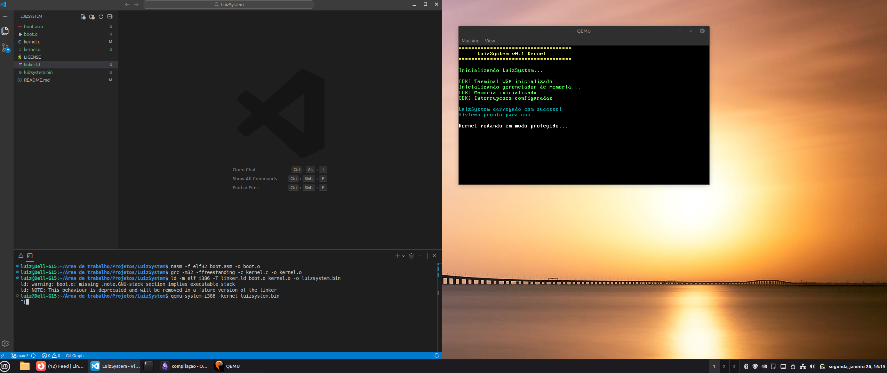

# LuizSystem

Um sistema operacional com meu nome para fins educacionais e para aprendizado.

## Sobre

Kernel minimalista em C para arquitetura x86, desenvolvido para aprender sobre sistemas operacionais e programação de baixo nível.

## Captura de tela



## Estrutura

```
LuizSystem/
├── boot.asm
├── kernel.c
├── linker.ld
├── README.md
└── LICENSE
```

## Compilação

```bash
# Compilar boot
nasm -f elf32 boot.asm -o boot.o

# Compilar kernel
gcc -m32 -ffreestanding -c kernel.c -o kernel.o

# Linkar
ld -m elf_i386 -T linker.ld boot.o kernel.o -o luizsystem.bin
```

## Executar

```bash
# Direto com QEMU
qemu-system-i386 -kernel luizsystem.bin

# Ou criar ISO bootável
mkdir -p iso/boot/grub
cp luizsystem.bin iso/boot/
echo 'menuentry "LuizSystem" { multiboot /boot/luizsystem.bin }' > iso/boot/grub/grub.cfg
grub-mkrescue -o luizsystem.iso iso/
qemu-system-i386 -cdrom luizsystem.iso
```

## Licença

MIT License - veja [LICENSE](#licença-mit) para detalhes.

### Licença MIT

```
MIT License

Copyright (c) 2026 LuizSystem

Permission is hereby granted, free of charge, to any person obtaining a copy
of this software and associated documentation files (the "Software"), to deal
in the Software without restriction, including without limitation the rights
to use, copy, modify, merge, publish, distribute, sublicense, and/or sell
copies of the Software, and to permit persons to whom the Software is
furnished to do so, subject to the following conditions:

The above copyright notice and this permission notice shall be included in all
copies or substantial portions of the Software.

THE SOFTWARE IS PROVIDED "AS IS", WITHOUT WARRANTY OF ANY KIND, EXPRESS OR
IMPLIED, INCLUDING BUT NOT LIMITED TO THE WARRANTIES OF MERCHANTABILITY,
FITNESS FOR A PARTICULAR PURPOSE AND NONINFRINGEMENT. IN NO EVENT SHALL THE
AUTHORS OR COPYRIGHT HOLDERS BE LIABLE FOR ANY CLAIM, DAMAGES OR OTHER
LIABILITY, WHETHER IN AN ACTION OF CONTRACT, TORT OR OTHERWISE, ARISING FROM,
OUT OF OR IN CONNECTION WITH THE SOFTWARE OR THE USE OR OTHER DEALINGS IN THE
SOFTWARE.
```

---

**LuizSystem** - se você leu até aqui pode clonar e usar como quiser.